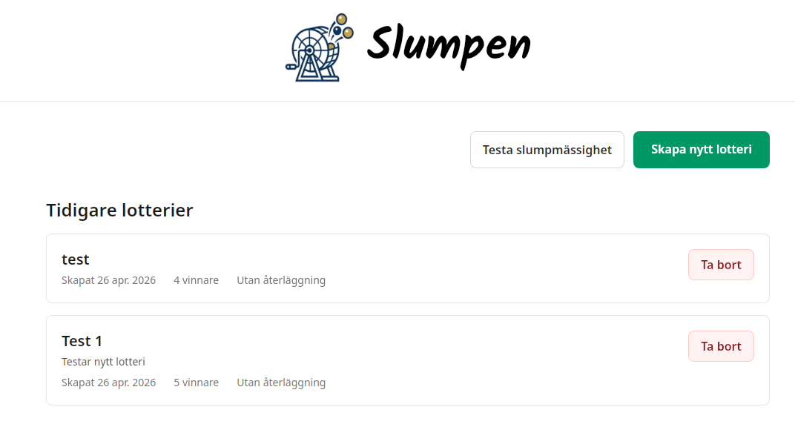
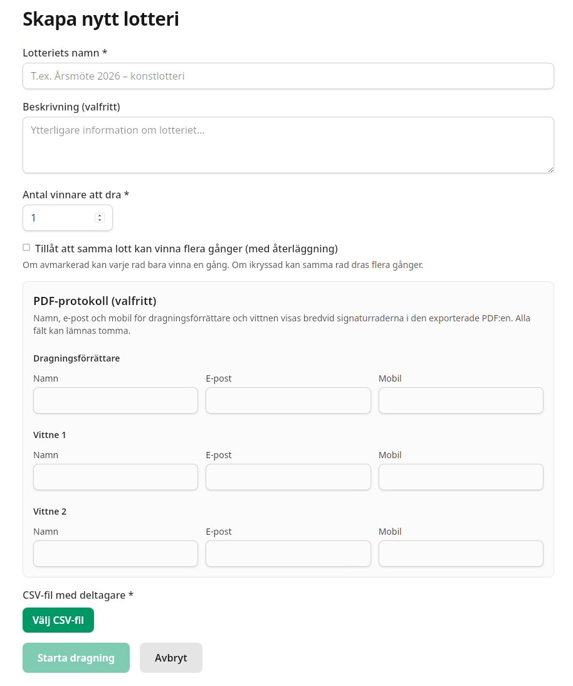
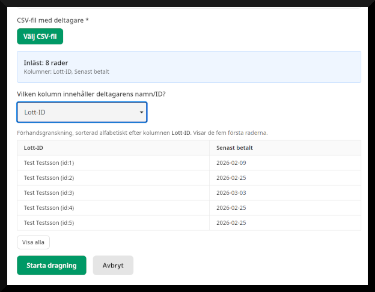
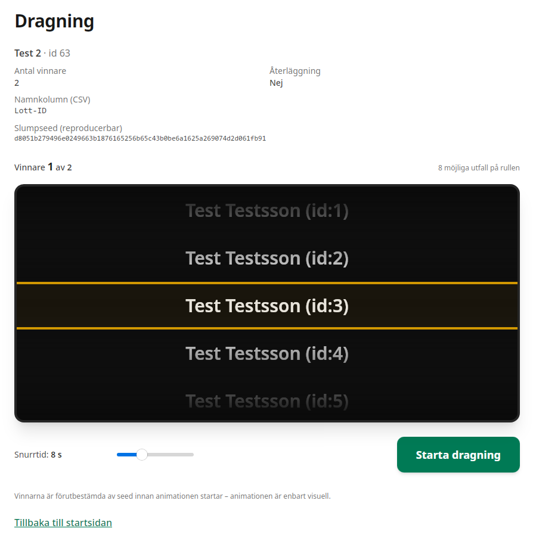

# Slumpen

[](LICENSE)
[](https://tauri.app/)
[](https://kit.svelte.dev/)
[](https://www.rust-lang.org/)

Skrivbordsapp för **transparenta, granskningsbara lotteridragningar** – till exempel för konstföreningar och liknande. Deltagarlistan importeras som CSV, dragningen görs med ett slumpmässigt frö och du kan exportera ett PDF-protokoll för signering.

## Funktioner

- **CSV-import** av deltagarlista
- **Animerad tombola-dragning** med reproducerbart frö (ChaCha20-baserad PRNG)
- **PDF-protokoll** med plats för officiella signaturer
- **Slumpmässighetstester** med statistik och diagram
- **Lokal SQLite-databas** – ingen molnberoende

## Skärmdumpar

Inga skärmdumpar i repot än. Lägg gärna till bilder här när du har dem, t.ex.:

```markdown





```

Skapa mappen `docs/screenshots/` om du vill versionera bilderna i Git.

## Snabbstart

**Förkunskaper:** [Node.js](https://nodejs.org/) (≥ 20 rekommenderas), [pnpm](https://pnpm.io/), [Rust](https://www.rust-lang.org/tools/install) med Cargo (Tauri v2).

```bash
git clone https://github.com/vapehe/slumpen.git
cd slumpen
pnpm install
pnpm tauri dev
```

**Övrigt:**

- Endast webbgränssnitt (utan Tauri): `pnpm dev`
- Produktionsbygge för skrivbord: `pnpm tauri build`
- Tester: `pnpm test:run`

## Licens

[MIT](LICENSE)
